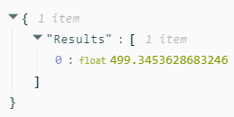

**Curso do [DIO](https://web.dio.me) (BootCamp - Microsoft Azure AI Fundamentals)**

Aprendizado de máquina automatizado para previsão de aluguel de bicicletas.

segundo as instruções do passo a passo descrito no link:

<https://microsoftlearning.github.io/mslearn-ai-fundamentals/Instructions/Labs/01-machine-learning.html>

passos de referência usado (traduzido por: google translate).

1. Configurações básicas :
   1. Nome do trabalho : mslearn-bike-automl
   1. Novo nome do experimento : mslearn-bike-rental
   1. Descrição : Aprendizado de máquina automatizado para previsão de aluguel de bicicletas
   1. Marcadores : *nenhum*
1. Tipo de tarefa e dados :
   1. Selecione o tipo de tarefa : Regressão
   1. Selecionar conjunto de dados : crie um novo conjunto de dados com as seguintes configurações:
      1. Tipo de dados :
         1. Nome : aluguel de bicicletas
         1. Descrição : dados históricos de aluguel de bicicletas
         1. Tipo : Tabular
      1. Fonte de dados :
         1. Selecione Dos arquivos da web
      1. URL da Web :
         1. URL da Web :https://aka.ms/bike-rentals
         1. Ignorar validação de dados : *não selecionar*
      1. Configurações :
         1. Formato de arquivo : Delimitado
         1. Delimitador : Vírgula
         1. Codificação : UTF-8
         1. Cabeçalhos de coluna : apenas o primeiro arquivo possui cabeçalhos
         1. Pular linhas : Nenhum
         1. O conjunto de dados contém dados multilinhas : *não selecione*
      1. Esquema :
         1. Incluir todas as colunas exceto Caminho
         1. Revise os tipos detectados automaticamente
   1. Selecione Criar . Após a criação do conjunto de dados, selecione o conjunto de dados de aluguel de bicicletas para continuar a enviar o trabalho de ML automatizado.
1. Configurações de tarefa :
   1. Tipo de tarefa : Regressão
   1. Conjunto de dados : aluguel de bicicletas
   1. Coluna de destino : Aluguéis (inteiro)
   1. Configurações adicionais :
      1. Métrica primária : raiz do erro quadrático médio normalizado
      1. Explique o melhor modelo : *Não selecionado*
      1. Usar todos os modelos suportados : Desmarcado . *Você restringirá o trabalho para tentar apenas alguns algoritmos específicos.*
      1. Modelos permitidos : *Selecione apenas RandomForest e LightGBM — normalmente você gostaria de tentar o máximo possível, mas cada modelo adicionado aumenta o tempo necessário para executar o trabalho.*
   1. Limites : *expanda esta seção*
      1. Máximo de testes : 3
      1. Máximo de testes simultâneos : 3
      1. Máximo de nós : 3
      1. Limite de pontuação da métrica : 0,085 ( *para que, se um modelo atingir uma pontuação da métrica de erro quadrático médio normalizado de 0,085 ou menos, o trabalho termina.* )
      1. Tempo limite : 15
      1. Tempo limite de iteração : 15
      1. Habilitar rescisão antecipada : *selecionado*
   1. Validação e teste :
      1. Tipo de validação : divisão de validação de trem
      1. Porcentagem de dados de validação : 10
      1. Conjunto de dados de teste : Nenhum
1. Calcular :
   1. Selecione o tipo de computação : sem servidor
   1. Tipo de máquina virtual : CPU
   1. Camada de máquina virtual : Dedicada
   1. Tamanho da máquina virtual : Standard\_DS3\_V2\*
   1. Número de instâncias : 1
1. \* *Se a sua assinatura restringir os tamanhos de VM disponíveis para você, escolha qualquer tamanho disponível.*
1. Envie o trabalho de treinamento. Ele inicia automaticamente.
1. Espere o trabalho terminar. Pode demorar um pouco – agora pode ser um bom momento para uma pausa para o café!

continua no link: <https://microsoftlearning.github.io/mslearn-ai-fundamentals/Instructions/Labs/01-machine-learning.html>

…………………………………………………………………………………………………..

**Resultados**

## Melhor resumo de modelo
- **Nome do algoritmo**
  - [**VotingEnsemble**](https://ml.azure.com/experiments/id/f5cc718c-f57a-4dc2-adf0-360ace8367bd/runs/mslearn-bike-automl_2?wsid=/subscriptions/c04e1513-d39b-4ac7-ba2f-f716ee180c66/resourceGroups/L1/providers/Microsoft.MachineLearningServices/workspaces/laboratorio800&tid=cddc4540-7573-4822-80d7-a0c045284814#model)
- **Erro de quadrado de média de raiz normalizado**
  - **0.08565**
- **Amostragem**
  - **100.00 %**

